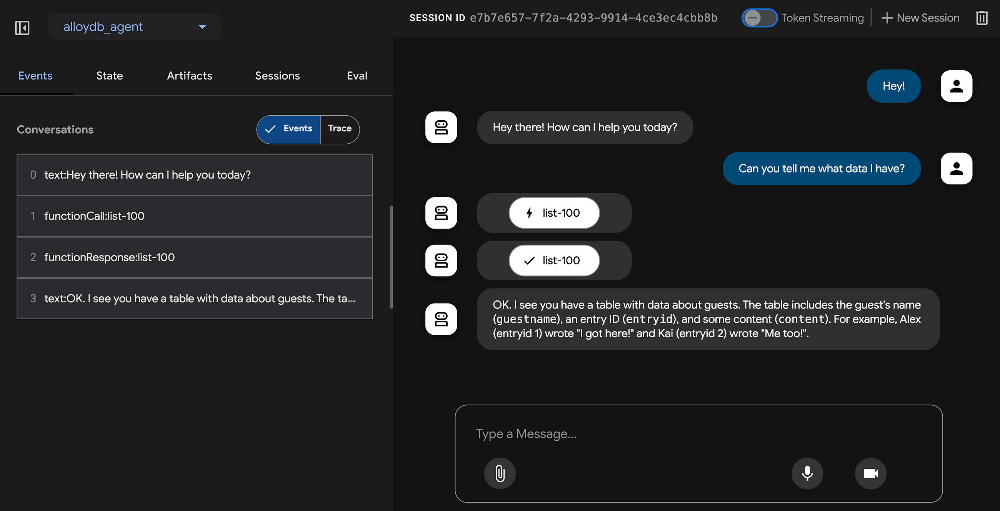

# AlloyDB MCP ADK Example

This example demonstrates how to interact with an AlloyDB database using AI Agents with the Model Context Protocol (MCP) Database Toolbox and Google Agent Development Kit (ADK).



## Prerequisites

- Access to an [AlloyDB instance](https://cloud.google.com/alloydb) on Google Cloud Platform
- [Gemini API key](https://aistudio.google.com/apikey) for accessing Google AI models
- Python 3.10 or newer
- [uv](https://github.com/astral-sh/uv) package manager

## Setup

1. Synchronize dependencies using uv:

    ```bash
    uv sync
    ```

1. Create the environment files:

    ```bash
    cp .env.example .env
    cp alloydb_agent/.env.example alloydb_agent/.env
    ```

1. Edit the `.env` files and fill in your credentials:
   - In the root `.env` file:
     - Fill in AlloyDB connection details (`ALLOYDB_PROJECT`, `ALLOYDB_REGION`, etc.)
   - In the `alloydb_agent/.env` file:
     - For Google AI API (default):
       - Set `GOOGLE_API_KEY` with your Gemini API key
     - OR for Vertex AI:
       - See the [ADK documentation](https://google.github.io/adk-docs/get-started/quickstart/#set-up-the-model) for complete Vertex AI setup instructions

1. Source the environment variables:

    ```bash
    source .env
    ```

1. Download the [MCP Toolbox for Databases](https://github.com/googleapis/genai-toolbox)

    ```bash
    export OS="linux/amd64" # one of linux/amd64, darwin/arm64, darwin/amd64, or windows/amd64
    curl -O https://storage.googleapis.com/genai-toolbox/v0.6.0/$OS/toolbox
    ```

1. Start the MCP Toolbox with the provided tools configuration:

    ```bash
    # Replace with the actual path to your MCP Toolbox executable
    ./toolbox --tools-file "alloy-tools.yaml"
    ```

1. In a separate terminal, activate the virtual environment and start the ADK server:

    ```bash
    source .venv/bin/activate
    adk web
    ```

    The ADK web interface should now be available at http://localhost:8080, where you can interact with your AlloyDB database using natural language.

## Disclaimer

This is example/demo code and may not be actively maintained or ready for production deployment. Use at your own risk.